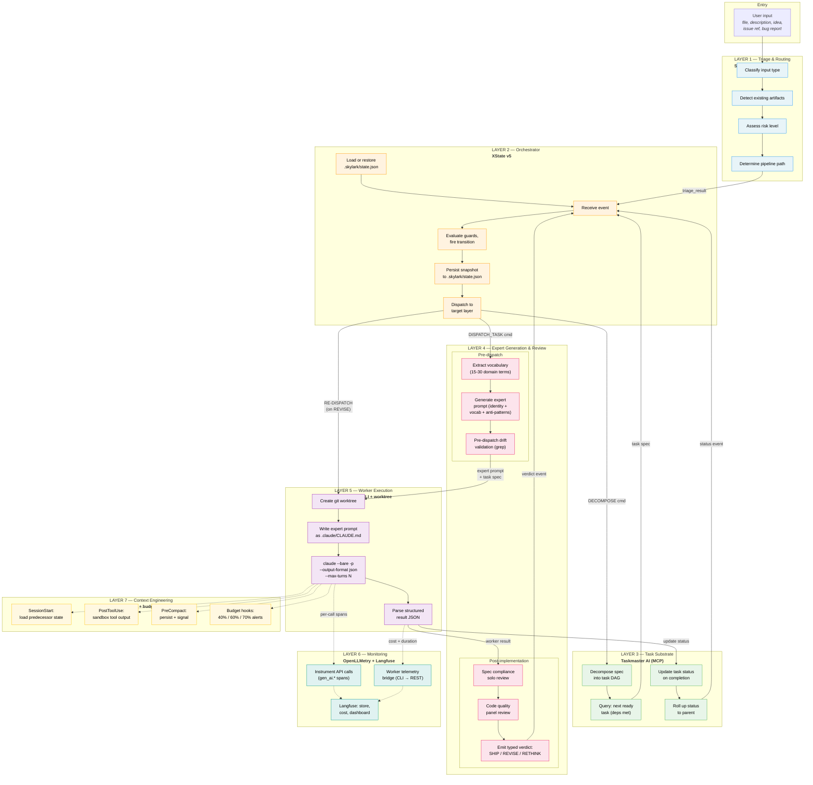

# Composed Pipeline — Architecture Overview

An AI-assisted development pipeline assembled from small, independently
replaceable tools with file-based contracts between each layer. No
monolithic framework dependency. Every layer can be swapped without
rebuilding the rest.

## Layers

| # | Layer | Primary tool(s) | Responsibility |
|---|---|---|---|
| 1 | Triage & routing | Skylark skills | Classify input, assess risk, determine pipeline path |
| 2 | Orchestrator | XState v5 | Deterministic state machine driving stage transitions |
| 3 | Task substrate | Taskmaster AI (MCP) | Task decomposition, DAG tracking, status management |
| 4 | Expert generation & review | Skylark skills + `_shared/` | Vocabulary-routed prompts, panel review, typed verdicts |
| 5 | Worker execution | Claude Code CLI + git worktrees | Isolated per-task implementation sessions |
| 6 | Monitoring & observability | OpenLLMetry + Langfuse | Telemetry capture, cost tracking, dashboards |
| 7 | Context engineering | context-mode + budget hooks | Context conservation, predecessor query, budget enforcement |

Layers 1-5 form the sequential pipeline. Layers 6-7 are cross-cutting
concerns that attach to every worker session.

## End-to-end flow



## Risk-based pipeline activation

Not every layer runs for every task. The triage layer determines risk,
and the orchestrator activates stages accordingly.

| Stage | Trivial | Standard | Elevated | Critical |
|---|:---:|:---:|:---:|:---:|
| L1 Triage | yes | yes | yes | yes |
| L3 Decomposition | skip | skip | yes | yes |
| L4 Expert generation | skip | yes | yes | yes |
| L4 Spec review | skip | skip | Opus 3-4 | Opus 5→3 |
| L4 Plan review | skip | skip | Opus 3-4 | Opus 5→3 |
| L5 Worktree isolation | no | yes | yes | yes |
| L4 Code quality panel | skip | Sonnet 2-3 | Sonnet 3-4 | Opus 3-4 |
| L6 Telemetry | yes | yes | yes | yes |
| L7 Context engineering | yes | yes | yes | yes |

## File layout

```
.skylark/
├── state.json                  # XState persisted snapshot (L2)
├── experts/
│   └── TASK-NNN.md             # Generated expert prompts (L4)
├── verdicts/
│   └── TASK-NNN.json           # Review verdicts (L4)
├── results/
│   └── TASK-NNN.json           # Worker results (L5)
└── telemetry/
    └── TASK-NNN.json           # Per-task cost/duration (L6)

.taskmaster/
├── tasks.json                  # Canonical task DAG (L3)
└── config.json                 # Taskmaster configuration (L3)

docs/
├── specs/
│   └── SPEC-NNN-<slug>.md      # Spec artifacts (L1/L4)
├── plans/
│   └── PLAN-NNN-<slug>.md      # Plan artifacts (L4)
├── reports/
│   └── R-<timestamp>-*.md      # Review reports (L4)
└── notes/
    └── NOTE-NNN-<slug>.md      # Session notes (L5)
```

## Contract summary

Each layer's input and output contracts are defined in the layer's
spec document. The overview here shows the flow:

```
L1 produces → triage_result (risk, type, path, artifact refs)
     ↓
L2 consumes triage_result → dispatches DECOMPOSE or DISPATCH_TASK
     ↓                ↑
L3 produces → task specs   │  L3 produces → status events
     ↓                     │       ↑
L4 produces → expert prompt + drift check   │
     ↓                     │       │
L5 produces → worker result (status, cost, files changed)
     ↓                     │       │
L4 produces → typed verdict (SHIP/REVISE/RETHINK)
                           │       │
     └─────────────────────┘       │
     verdict event → L2 routes:    │
       SHIP → L3 update complete ──┘
       REVISE → L5 re-dispatch (round < 2)
       RETHINK → escalate to user
```

## Spec documents

- [01 — Triage & routing](01-triage-and-routing.md)
- [02 — Orchestrator](02-orchestrator.md)
- [03 — Task substrate](03-task-substrate.md)
- [04 — Expert generation & review](04-expert-generation-and-review.md)
- [05 — Worker execution](05-worker-execution.md)
- [06 — Monitoring & observability](06-monitoring.md)
- [07 — Context engineering](07-context-engineering.md)
