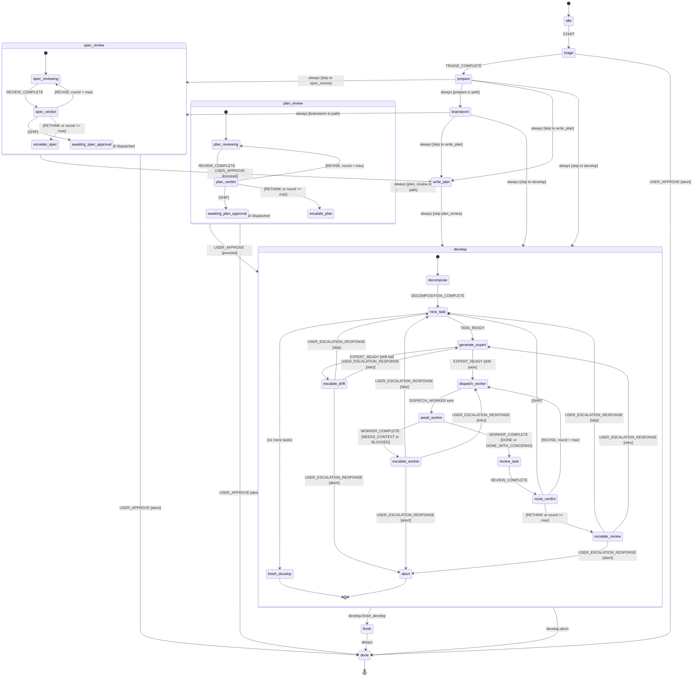

# Layer 2 -- Orchestrator

Deterministic state machine that coordinates the composed pipeline.
Built on XState v5. Zero domain reasoning. All substantive decisions
are delegated to Layer 4 (review) or to the user.

---

## 1. Purpose

The orchestrator receives typed events from every other layer, evaluates
guard conditions, fires transitions, persists its state to disk, and
dispatches commands to the appropriate layer. It is the only component
that knows the full pipeline topology.

**What it does:**

- Maintains a single XState v5 actor as the source of truth for pipeline state
- Evaluates guards based on risk level and triage path to skip inactive stages
- Persists a snapshot to `.skylark/state.json` after every transition
- Resumes from that snapshot on startup or after crash
- Enforces review-round limits, timeout thresholds, and model selection
- Escalates to the user when the pipeline cannot proceed autonomously

**What it does NOT do:**

- Evaluate code quality, spec correctness, or plan adequacy (Layer 4)
- Decompose specs into tasks or track task DAGs (Layer 3)
- Execute implementation work or run CLI commands (Layer 5)
- Generate expert prompts or vocabulary routes (Layer 4)
- Hold conversation history, code content, or large artifacts in context

**Context ceiling:** The orchestrator context holds only pipeline
metadata -- current state, task statuses, round counts, risk level,
path array, and per-task summary records. Target: <=20K tokens
invariant to pipeline length. Artifact content (specs, plans, code,
review reports) is referenced by file path, never inlined.

---

## 2. Components

### XState v5

State machine library. Zero runtime dependencies, MIT license.
Provides `createMachine()`, `createActor()`, `getPersistedSnapshot()`,
and `restoreSnapshot()`. Guards, actions, and invoked actors are
registered via the `setup()` API with full TypeScript inference.

### Persistence wrapper

Thin module that:

1. On startup: reads `.skylark/state.json`, calls `createActor(machine, { snapshot })` if file exists
2. On every transition: calls `actor.getPersistedSnapshot()`, writes to `.skylark/state.json` via atomic rename (`write tmp + rename`)
3. Exposes `persist()` and `restore()` functions; no other responsibilities

### Event bus

Receives typed events from all layers and feeds them to
`actor.send(event)`. Dispatches output commands to the appropriate
layer handler. The bus is a function call boundary, not a network
protocol -- all layers run in the same process for v1.

### Machine context (TypeScript)

```typescript
interface OrchestratorContext {
  // From triage
  input_type: InputType;
  risk: RiskLevel;
  path: Stage[];
  existing_artifact: ArtifactRef | null;
  external_ref: string | null;
  decompose: boolean;
  domain_clusters: string[];

  // Task tracking
  tasks: Map<number, TaskSummary>;
  current_task_id: number | null;
  task_count: number;
  tasks_complete: number;

  // Review tracking
  review_round: number;

  // Spec/plan paths
  spec_path: string | null;
  plan_path: string | null;

  // Configuration (set once from risk level)
  max_review_rounds: number;
  worker_model: 'sonnet' | 'opus';
  worker_max_turns: number;
  review_model: 'sonnet' | 'opus';
  review_panel_size: number;
}

interface TaskSummary {
  id: number;
  title: string;
  status: TaskStatus;
  review_round: number;
  worker_result_path: string | null;
  expert_prompt_path: string | null;
  cost_usd: number;
  duration_ms: number;
}

type InputType = 'spec' | 'plan' | 'task' | 'raw-idea' | 'raw-problem' | 'raw-input' | 'external-ref';
type RiskLevel = 'trivial' | 'standard' | 'elevated' | 'critical';
type TaskStatus = 'pending' | 'expert_ready' | 'in_progress' | 'review' | 'done' | 'blocked' | 'skipped';
type Stage = 'triage' | 'prepare' | 'brainstorm' | 'spec_review' | 'write_plan'
           | 'plan_review' | 'develop' | 'finish';
```

---

## 3. Inputs

All events the orchestrator receives. Each event is a discriminated
union member keyed on `type`.

### From Layer 1 (Triage)

```typescript
interface TriageComplete {
  type: 'TRIAGE_COMPLETE';
  input_type: InputType;
  risk: RiskLevel;
  path: Stage[];
  existing_artifact: ArtifactRef | null;
  external_ref: string | null;
  decompose: boolean;
  domain_clusters: string[];
}
```

### From Layer 3 (Task Substrate)

```typescript
interface TaskReady {
  type: 'TASK_READY';
  task_id: number;
  task: {
    id: number;
    title: string;
    dependencies: number[];
    status: string;
    details: string;
    acceptanceCriteria: string[];
    relevantFiles: string[];
  };
}

interface DecompositionComplete {
  type: 'DECOMPOSITION_COMPLETE';
  task_count: number;
  task_ids: number[];
  domains: string[];
}

interface StatusRollup {
  type: 'STATUS_ROLLUP';
  parent_id: number;
  children_complete: number;
  children_total: number;
  all_complete: boolean;
}
```

### From Layer 4 (Expert Generation)

```typescript
interface ExpertReady {
  type: 'EXPERT_READY';
  task_id: number;
  expert_prompt_path: string;
  drift_check: 'pass' | 'fail';
  drift_details: string | null;
}
```

### From Layer 4 (Review)

```typescript
interface ReviewComplete {
  type: 'REVIEW_COMPLETE';
  task_id: number;
  verdict: 'SHIP' | 'REVISE' | 'RETHINK';
  round: number;
  report_path: string;
  findings: Array<{
    severity: string;
    description: string;
    file: string;
    line: number;
  }>;
}
```

### From Layer 5 (Worker Execution)

```typescript
interface WorkerComplete {
  type: 'WORKER_COMPLETE';
  task_id: number;
  status: 'DONE' | 'DONE_WITH_CONCERNS' | 'NEEDS_CONTEXT' | 'BLOCKED';
  result_path: string;
  cost_usd: number;
  duration_ms: number;
  files_changed: string[];
  concerns: string | null;
}
```

### From user

```typescript
interface UserApprove {
  type: 'USER_APPROVE';
  stage: string;
  decision: 'proceed' | 'abort';
}

interface UserEscalationResponse {
  type: 'USER_ESCALATION_RESPONSE';
  task_id: number;
  action: 'retry' | 'skip' | 'abort';
}
```

---

## 4. State machine definition

### Top-level states

```
idle -> triage -> prepare -> brainstorm -> spec_review -> write_plan -> plan_review -> develop -> finish -> done
```

Most work skips most stages. The `path` array from triage determines
which states are visited. Inactive states are bypassed immediately via
`always` transitions with `shouldSkip` guards.

### Mermaid statechart



### Develop sub-machine detail

The `develop` compound state manages the task-iteration loop. On entry,
it dispatches `DECOMPOSE` to Layer 3 (unless `decompose` is false, in
which case it dispatches `QUERY_NEXT_TASK` directly). It then cycles
through tasks one at a time:

1. **next_task** -- sends `QUERY_NEXT_TASK` to Layer 3. Waits for
   `TASK_READY`. If Layer 3 returns no tasks (all complete), transitions
   to `finish_develop`.

2. **generate_expert** -- sends `GENERATE_EXPERT` to Layer 4. Waits for
   `EXPERT_READY`. If drift check fails, escalates to user.

3. **dispatch_worker** -- sends `DISPATCH_WORKER` to Layer 5. Resets
   `review_round` to 0. Waits for `WORKER_COMPLETE`.

4. **review_task** -- sends `RUN_REVIEW` to Layer 4. Increments
   `review_round`. Waits for `REVIEW_COMPLETE`.

5. **route_verdict** -- evaluates the review verdict:
   - `SHIP`: sends `UPDATE_TASK_STATUS(done)` to Layer 3, transitions to `next_task`
   - `REVISE` (round < max): transitions back to `dispatch_worker` with findings attached
   - `RETHINK` or round >= max: escalates to user

### Transition table (complete)

| Source state | Event | Guard | Target state | Actions |
|---|---|---|---|---|
| `idle` | `START` | -- | `triage` | `dispatchTriage` |
| `triage` | `TRIAGE_COMPLETE` | -- | `prepare` | `storeTriageResult`, `configureFromRisk` |
| `triage` | `USER_APPROVE` | `isAbort` | `done` | `recordAbort` |
| `prepare` | _always_ | `shouldSkip('prepare')` | _next active state_ | -- |
| `prepare` | _always_ | `isInPath('prepare')` | -- (stay, do work) | `dispatchPrepare` |
| `prepare` | `PREPARE_COMPLETE` | -- | _next active state_ | `storePrepareResult` |
| `brainstorm` | _always_ | `shouldSkip('brainstorm')` | _next active state_ | -- |
| `brainstorm` | _always_ | `isInPath('brainstorm')` | -- | `dispatchBrainstorm` |
| `brainstorm` | `BRAINSTORM_COMPLETE` | -- | _next active state_ | `storeBrainstormResult` |
| `spec_review` | _always_ | `shouldSkip('spec_review')` | _next active state_ | -- |
| `spec_review` | _entry_ | `isInPath('spec_review')` | -- | `dispatchSpecReview` |
| `spec_review` | `REVIEW_COMPLETE` | `isShip` | _await approval or next_ | `storeReviewResult` |
| `spec_review` | `REVIEW_COMPLETE` | `isRevise`, `belowMaxRounds` | `spec_review` | `storeReviewResult`, `dispatchSpecReview` |
| `spec_review` | `REVIEW_COMPLETE` | `isRethink` or `atMaxRounds` | `awaiting_user` | `requestApproval` |
| `spec_review` | `USER_APPROVE` | `isProceed` | `write_plan` | -- |
| `spec_review` | `USER_APPROVE` | `isAbort` | `done` | `recordAbort` |
| `write_plan` | _always_ | `shouldSkip('write_plan')` | _next active state_ | -- |
| `write_plan` | _always_ | `isInPath('write_plan')` | -- | `dispatchWritePlan` |
| `write_plan` | `PLAN_COMPLETE` | -- | _next active state_ | `storePlanResult` |
| `plan_review` | _always_ | `shouldSkip('plan_review')` | _next active state_ | -- |
| `plan_review` | _entry_ | `isInPath('plan_review')` | -- | `dispatchPlanReview` |
| `plan_review` | `REVIEW_COMPLETE` | `isShip` | _await approval or next_ | `storeReviewResult` |
| `plan_review` | `REVIEW_COMPLETE` | `isRevise`, `belowMaxRounds` | `plan_review` | `storeReviewResult`, `dispatchPlanReview` |
| `plan_review` | `REVIEW_COMPLETE` | `isRethink` or `atMaxRounds` | `awaiting_user` | `requestApproval` |
| `plan_review` | `USER_APPROVE` | `isProceed` | `develop` | -- |
| `plan_review` | `USER_APPROVE` | `isAbort` | `done` | `recordAbort` |
| `develop.decompose` | _entry_ | `shouldDecompose` | -- | `dispatchDecompose` |
| `develop.decompose` | _always_ | `not(shouldDecompose)` | `develop.next_task` | `dispatchQueryNextTask` |
| `develop.decompose` | `DECOMPOSITION_COMPLETE` | -- | `develop.next_task` | `storeDecomposition`, `dispatchQueryNextTask` |
| `develop.next_task` | `TASK_READY` | -- | `develop.generate_expert` | `storeCurrentTask`, `dispatchGenerateExpert` |
| `develop.next_task` | `STATUS_ROLLUP` | `allTasksComplete` | `develop.finish_develop` | -- |
| `develop.generate_expert` | `EXPERT_READY` | `driftPass` | `develop.dispatch_worker` | `storeExpertResult`, `dispatchWorker` |
| `develop.generate_expert` | `EXPERT_READY` | `driftFail` | `develop.escalate_drift` | `escalateDrift` |
| `develop.dispatch_worker` | _entry_ | -- | -- | `resetReviewRound` |
| `develop.await_worker` | `WORKER_COMPLETE` | `workerSucceeded` | `develop.review_task` | `storeWorkerResult`, `dispatchReview` |
| `develop.await_worker` | `WORKER_COMPLETE` | `workerBlocked` | `develop.escalate_worker` | `storeWorkerResult`, `escalateWorker` |
| `develop.review_task` | `REVIEW_COMPLETE` | -- | `develop.route_verdict` | `storeReviewResult` |
| `develop.route_verdict` | _always_ | `isShip` | `develop.next_task` | `markTaskDone`, `dispatchQueryNextTask` |
| `develop.route_verdict` | _always_ | `isRevise`, `belowMaxRounds` | `develop.dispatch_worker` | `incrementRound`, `dispatchWorker` |
| `develop.route_verdict` | _always_ | `isRethink` or `atMaxRounds` | `develop.escalate_review` | `escalateReview` |
| `develop.escalate_*` | `USER_ESCALATION_RESPONSE` | `isRetry` | _(re-enter appropriate state)_ | `resetForRetry` |
| `develop.escalate_*` | `USER_ESCALATION_RESPONSE` | `isSkip` | `develop.next_task` | `markTaskSkipped`, `dispatchQueryNextTask` |
| `develop.escalate_*` | `USER_ESCALATION_RESPONSE` | `isAbort` | `develop.abort` | `recordAbort` |
| `finish` | _entry_ | -- | -- | `dispatchFinish` |
| `finish` | `FINISH_COMPLETE` | -- | `done` | -- |
| `done` | _entry_ | -- | -- | `emitPipelineSummary` |

_"next active state"_ means: scan forward through the ordered stage
list (`prepare`, `brainstorm`, `spec_review`, `write_plan`,
`plan_review`, `develop`, `finish`) and transition to the first stage
present in `context.path`. Implemented as a chain of `always`
transitions with `shouldSkip` guards.

---

## 5. Outputs

All commands the orchestrator dispatches. Each command is sent by an
XState action function that constructs the payload and calls the
appropriate layer handler.

### To Layer 1

```typescript
interface RunTriage {
  type: 'RUN_TRIAGE';
  input: {
    type: string;
    content: string;
    user_risk_override: RiskLevel | null;
  };
}
```

### To Layer 3

```typescript
interface Decompose {
  type: 'DECOMPOSE';
  spec_path: string;
  risk: RiskLevel;
}

interface QueryNextTask {
  type: 'QUERY_NEXT_TASK';
  filter: {
    status: 'pending';
    dependencies_met: true;
  };
}

interface UpdateTaskStatus {
  type: 'UPDATE_TASK_STATUS';
  task_id: number;
  status: string;
}
```

### To Layer 4

```typescript
interface GenerateExpert {
  type: 'GENERATE_EXPERT';
  task_id: number;
  task: TaskSpec;
  risk: RiskLevel;
  codebase_context: {
    entry_points: string[];
    recent_changes: string[];
    related_tests: string[];
  };
}

interface RunReview {
  type: 'RUN_REVIEW';
  task_id: number;
  worktree_path: string;
  task_spec: TaskSpec;
  worker_result: WorkerResult;
  risk: RiskLevel;
  round: number;
}
```

### To Layer 5

```typescript
interface DispatchWorker {
  type: 'DISPATCH_WORKER';
  task_id: number;
  expert_prompt_path: string;
  task_spec: TaskSpec;
  worktree_branch: string;
  max_turns: number;
  model: 'sonnet' | 'opus';
}
```

### To user

```typescript
interface RequestApproval {
  type: 'REQUEST_APPROVAL';
  stage: string;
  summary: string;
  risk: RiskLevel;
}

interface Escalate {
  type: 'ESCALATE';
  task_id: number;
  reason: string;
  options: Array<'retry' | 'skip' | 'abort'>;
}
```

---

## 6. Persistence and crash recovery

### Write path

After every transition, the persistence wrapper:

1. Calls `actor.getPersistedSnapshot()` to get the full serializable state
2. Writes to a temporary file `.skylark/state.json.tmp`
3. Calls `fs.renameSync()` to atomically replace `.skylark/state.json`

The atomic rename guarantees that `.skylark/state.json` is always a
complete, valid snapshot. A crash during write leaves only the tmp
file, which is ignored on restore.

### Read path

On startup:

1. If `.skylark/state.json` exists, read and parse it
2. Call `createActor(machine, { snapshot: parsed })` to restore
3. Call `actor.start()` -- the machine resumes at the persisted state
4. XState does NOT replay entry actions or re-fire `onDone` for already-completed states

If `.skylark/state.json` does not exist, create a fresh actor in `idle`.

### Crash scenarios

| Scenario | Recovery |
|---|---|
| Crash before any transition | No state file. Fresh start. |
| Crash after transition, after persist | State file is current. Resume at last state. |
| Crash during persist (mid-write) | Tmp file exists but `.json` is stale. Resume at previous state. Transition is re-attempted. |
| Crash during Layer 5 worker execution | Orchestrator resumes at `develop.await_worker`. Worker result never arrived. Timeout guard eventually fires `ESCALATE`. |
| Crash during Layer 4 review | Orchestrator resumes at `develop.review_task` or `spec_review`. Review result never arrived. Timeout guard fires. |

### Idempotency

Commands dispatched to other layers must be idempotent. If the
orchestrator crashes after persisting a transition but before the
target layer receives the command, the resumed orchestrator will
re-enter the state and re-dispatch the command. Layers 3, 4, and 5
must handle duplicate commands gracefully (detect already-started work,
return cached results).

---

## 7. Guard conditions

Guards are pure functions of `(context, event) -> boolean`. They
control which stages are active and how verdicts are routed.

### Path-based stage skipping

```typescript
// Skip a stage if it is not in the triage-determined path
function shouldSkip(stage: Stage) {
  return ({ context }) => !context.path.includes(stage);
}

// Inverse: stage is active
function isInPath(stage: Stage) {
  return ({ context }) => context.path.includes(stage);
}
```

The `path` array is set once by `TRIAGE_COMPLETE` and never modified.
Typical paths by risk level:

| Risk | Typical `path` value |
|---|---|
| trivial | `['triage', 'develop', 'finish']` |
| standard | `['triage', 'prepare', 'develop', 'finish']` |
| elevated | `['triage', 'prepare', 'spec_review', 'write_plan', 'plan_review', 'develop', 'finish']` |
| critical | `['triage', 'prepare', 'brainstorm', 'spec_review', 'write_plan', 'plan_review', 'develop', 'finish']` |

### Verdict routing

```typescript
function isShip({ event }) {
  return event.verdict === 'SHIP';
}

function isRevise({ event }) {
  return event.verdict === 'REVISE';
}

function isRethink({ event }) {
  return event.verdict === 'RETHINK';
}

function belowMaxRounds({ context }) {
  return context.review_round < context.max_review_rounds;
}

function atMaxRounds({ context }) {
  return context.review_round >= context.max_review_rounds;
}
```

### Worker status routing

```typescript
function workerSucceeded({ event }) {
  return event.status === 'DONE' || event.status === 'DONE_WITH_CONCERNS';
}

function workerBlocked({ event }) {
  return event.status === 'NEEDS_CONTEXT' || event.status === 'BLOCKED';
}
```

### Decomposition guard

```typescript
function shouldDecompose({ context }) {
  return context.decompose === true;
}
```

### User decision guards

```typescript
function isProceed({ event }) { return event.decision === 'proceed'; }
function isAbort({ event }) { return event.decision === 'abort'; }
function isRetry({ event }) { return event.action === 'retry'; }
function isSkip({ event }) { return event.action === 'skip'; }
```

### Drift check guard

```typescript
function driftPass({ event }) { return event.drift_check === 'pass'; }
function driftFail({ event }) { return event.drift_check === 'fail'; }
```

### Task completion guard

```typescript
function allTasksComplete({ context }) {
  return context.tasks_complete >= context.task_count && context.task_count > 0;
}
```

### User confirmation gate (risk-dependent)

```typescript
function requiresUserApproval({ context }) {
  if (context.risk === 'critical') return true;
  if (context.risk === 'elevated') return false; // only on escalation
  return false;
}
```

At `critical` risk, every review gate pauses for `USER_APPROVE`
before advancing. At `elevated` risk, only escalation scenarios
pause. At `standard` and `trivial`, the pipeline runs autonomously.

---

## 8. Error handling

### Unknown events

Events not defined in the current state's `on` transitions are
silently dropped by XState. The persistence wrapper logs dropped
events at `warn` level with the event type and current state for
debugging.

### Stuck states (timeout)

Each state that waits for an external event has a timeout. Timeouts
are implemented as `after` delayed transitions in XState:

| Waiting state | Timeout | Action on timeout |
|---|---|---|
| `develop.await_worker` | 30 minutes | `ESCALATE` to user with reason "worker timeout" |
| `develop.review_task` | 10 minutes | `ESCALATE` to user with reason "review timeout" |
| `spec_review` (per round) | 10 minutes | `ESCALATE` to user with reason "spec review timeout" |
| `plan_review` (per round) | 10 minutes | `ESCALATE` to user with reason "plan review timeout" |
| Any `awaiting_user` state | No timeout | Waits indefinitely; user is the bottleneck by design |

### Failed dispatches

If a command dispatch to another layer throws, the action catches the
error and sends an internal `DISPATCH_ERROR` event with the failed
command type and error message. This transitions the machine to an
`escalate` state for user intervention.

### Invalid state file

If `.skylark/state.json` exists but fails to parse (corrupted JSON,
schema mismatch after code update), the persistence wrapper:

1. Moves the corrupt file to `.skylark/state.json.corrupt.<timestamp>`
2. Logs a warning
3. Starts fresh from `idle`

### Review loop runaway

The `max_review_rounds` configuration caps how many REVISE cycles a
task can go through. When the cap is reached, the orchestrator
escalates to the user rather than looping indefinitely. This is
enforced by the `atMaxRounds` guard.

---

## 9. Configuration

Configuration is derived from the `risk` level set by triage. Values
are assigned once in the `configureFromRisk` action and stored in
the machine context.

### Risk-based configuration table

| Parameter | Trivial | Standard | Elevated | Critical |
|---|:---:|:---:|:---:|:---:|
| `max_review_rounds` | 1 | 2 | 2 | 3 |
| `worker_model` | sonnet | sonnet | sonnet | opus |
| `worker_max_turns` | 10 | 20 | 30 | 40 |
| `review_model` | sonnet | sonnet | sonnet | opus |
| `review_panel_size` | 0 | 2-3 | 3-4 | 5 (round 1), 2-3 (round 2+) |
| User approval gates | none | none | on escalation | every gate |
| Worker timeout | 10 min | 20 min | 30 min | 30 min |
| Review timeout | 5 min | 10 min | 10 min | 10 min |

### Adaptive panel narrowing (critical only)

At `critical` risk, the review panel starts at 5 experts in round 1.
On subsequent rounds, the orchestrator narrows to 2-3 experts who
produced the strongest findings in round 1. This is tracked in the
machine context and passed to `RUN_REVIEW` as a parameter.

### Model override

The user can override the worker or review model via `USER_APPROVE`
events or triage-time risk overrides. The orchestrator respects
user-declared risk as the ceiling -- it never downgrades a
user-specified risk level.

### Scope escalation

When Layer 4 or Layer 5 reports indicators of higher complexity than
the current risk level accounts for, the orchestrator:

1. Pauses the pipeline
2. Sends `ESCALATE` to the user with the new risk assessment
3. Waits for `USER_ESCALATION_RESPONSE`
4. If the user approves escalation, updates `context.risk` and
   reconfigures parameters via `configureFromRisk`

Escalation is always pause-and-notify, never automatic pipeline
restart.
