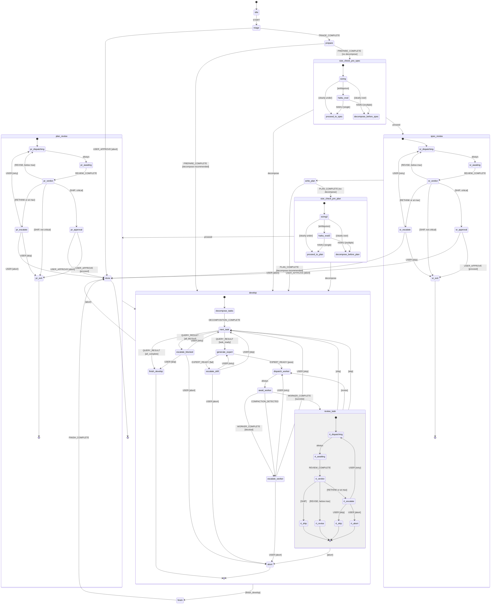

# Layer 2a -- Orchestrator Amendments

Amendments to the orchestrator spec (`02-orchestrator.md`) based on
pressure-testing the implementation plan against framework evaluations,
the ENG-180 retrospective, and task-complexity research. These changes
extend the existing spec; they do not replace it.

---

## 1. Bookend sizing gates

### Problem

Expensive review and planning stages can run on artifacts that are too
large or too complex, wasting tokens. Conversely, the planning process
itself can reveal complexity that was not apparent from the input (the
"cabin in the woods" problem -- a 50-token idea can elaborate into a
4,000-token plan).

### Design

Two distinct gate mechanisms, reflecting their different contexts.

### 1.1 Pre-review gate (incoming artifacts)

A new `size_check` state runs before `spec_review` and `plan_review`
when the artifact was not just produced by an agent in the current
pipeline run (i.e., it came from user input, was loaded from disk on
resume, or was imported from an external system).

The `size_check` state runs mechanical heuristics at zero LLM cost:

1. **Token count** of the artifact prose (excluding code blocks and
   JSON examples). Default hard ceiling: 2,500 tokens. Configurable
   via `sizing.max_prose_tokens` in `.skylark/config.json`.
2. **Prose line count** (hard-wrapped lines, excluding code blocks).
   Default hard ceiling: 200 lines. Configurable via
   `sizing.max_prose_lines`.
3. **File blast radius** -- count of distinct files referenced in the
   artifact. Default hard flag: 4+ files triggers decomposition, per
   SWE-Bench data showing a cliff in agent success rates at multi-file
   changes. Configurable via `sizing.max_file_blast_radius`.

Routing:

- Clearly under all thresholds: proceed to review.
- Clearly over any hard ceiling: route to decomposition (Layer 3)
  before review.
- Ambiguous (borderline on one or more signals): dispatch a cheap
  Haiku evaluation -- "Is this a single coherent concern or does it
  span multiple independent subsystems? Reply SINGLE or MULTIPLE with
  a one-sentence rationale." Route on the answer.
- If Haiku returns MULTIPLE: route to decomposition.
- If Haiku returns SINGLE: proceed to review.

The Haiku call is bounded to a single question with a forced-choice
answer. It is not open-ended reasoning.

### 1.2 Post-stage gate (agent just completed work)

When an agent completes a `prepare`, `brainstorm`, or `write_plan`
stage, its completion prompt includes a self-assessment:

> Before emitting your completion event, evaluate what you have
> produced:
>
> - Is this a single coherent concern or does it span multiple
>   independent subsystems?
> - Would this benefit from being broken into smaller pieces before
>   the next pipeline stage?
> - Has the elaboration process revealed scope that was not apparent
>   in the input?
>
> Set `decomposition_recommended` to true if decomposition is needed.
> Include a one-sentence rationale.

The agent's answer is encoded in the completion event:

```typescript
interface PrepareComplete {
  type: 'PREPARE_COMPLETE';
  spec_path: string;
  decomposition_recommended: boolean;
  decomposition_rationale: string | null;
}

interface BrainstormComplete {
  type: 'BRAINSTORM_COMPLETE';
  spec_path: string;
  decomposition_recommended: boolean;
  decomposition_rationale: string | null;
}

interface PlanComplete {
  type: 'PLAN_COMPLETE';
  plan_path: string;
  decomposition_recommended: boolean;
  decomposition_rationale: string | null;
}
```

The orchestrator checks `decomposition_recommended` via a guard. If
true, route to decomposition (Layer 3) before proceeding to the next
stage. If false, continue normally. The rationale is logged for
auditability but the orchestrator does not interpret it.

### 1.3 Pipeline flow with sizing gates

```
input → triage → prepare →
  [if prepare agent recommends decompose → Layer 3 → re-enter with pieces]
  [else → size_check_pre_spec (mechanical) → spec_review →
    [if review agent recommends decompose → Layer 3 → re-enter]
    [else → write_plan →
      [if plan agent recommends decompose → Layer 3 → re-enter]
      [else → size_check_pre_plan (mechanical) → plan_review → develop]]]
```

### 1.4 New states

Add to the top-level state list:

- `size_check_pre_spec` -- between `prepare`/`brainstorm` and
  `spec_review`
- `size_check_pre_plan` -- between `write_plan` and `plan_review`

Each follows the same pattern:

```
size_check_pre_*:
  entry: [runMechanicalSizing]
  always:
    [sizingClearlyUnder] → next review state
    [sizingClearlyOver] → decompose (enter develop.decompose with
                          decompose: true)
  on:
    SIZING_AMBIGUOUS:
      entry: [dispatchHaikuSizing]
    HAIKU_SIZING_RESULT:
      [isSingle] → next review state
      [isMultiple] → decompose
  after:
    60000: → escalate_dispatch  # Haiku call should not take > 1 min
```

### 1.5 New guards

```typescript
sizingClearlyUnder: ({ context }) =>
  context.last_sizing_result?.verdict === 'under'

sizingClearlyOver: ({ context }) =>
  context.last_sizing_result?.verdict === 'over'

decompositionRecommended: ({ context, event }) =>
  event.decomposition_recommended === true
```

### 1.6 New context fields

```typescript
interface SizingResult {
  token_count: number;
  prose_line_count: number;
  file_blast_radius: number;
  verdict: 'under' | 'over' | 'ambiguous';
}

// Add to OrchestratorContext:
last_sizing_result: SizingResult | null;
```

### 1.7 New events

```typescript
interface SizingAmbiguous {
  type: 'SIZING_AMBIGUOUS';
  sizing_result: SizingResult;
}

interface HaikuSizingResult {
  type: 'HAIKU_SIZING_RESULT';
  answer: 'single' | 'multiple';
  rationale: string;
}
```

### 1.8 Decomposition routing

Two distinct decomposition paths exist, triggered at different points:

**Pre-develop decomposition (sizing gate triggers):**

When a sizing gate (mechanical or agent self-assessment) determines an
artifact is too large BEFORE reaching the `develop` stage, the
orchestrator dispatches `DECOMPOSE_ARTIFACT` to Layer 3 with the
artifact path and type. Layer 3 breaks the artifact into sub-artifacts
of the same type (a large spec becomes multiple smaller specs, a large
plan becomes multiple smaller plans). Each sub-artifact re-enters the
pipeline at `triage`, which classifies it independently. This is a
different command from the in-develop `DECOMPOSE` which breaks a spec
into implementable tasks.

**In-develop decomposition (existing flow):**

When the pipeline reaches `develop.decompose`, it dispatches
`DECOMPOSE` to Layer 3 to break a spec into an implementable task DAG.
This is the existing flow from `02-orchestrator.md` and is unchanged.

**Recursive bounding:**

Pre-develop decomposition can produce sub-artifacts that themselves
trigger sizing gates. Recursion is bounded by the mechanical
thresholds -- each piece must be smaller than the parent. A hard
recursion depth limit of 3 prevents infinite loops (if an artifact
still exceeds thresholds after 3 decomposition rounds, escalate to the
user).

### 1.9 New command: DECOMPOSE_ARTIFACT

```typescript
interface DecomposeArtifact {
  type: 'DECOMPOSE_ARTIFACT';
  artifact_path: string;
  artifact_type: 'spec' | 'plan';
  reason: 'size_gate_mechanical' | 'size_gate_haiku' | 'agent_recommended';
  sizing_result?: SizingResult;
}
```

This is distinct from the existing `DECOMPOSE` command, which operates
on a spec to produce implementable tasks.

---

## 2. Review loop inner states

### Problem

The plan describes `spec_review` and `plan_review` as flat states with
self-transitions for the REVISE loop. This loses crash recovery
precision and makes it impossible to distinguish "waiting for review
result" from "waiting for user approval."

### Design

Both `spec_review` and `plan_review` become compound states with
identical internal structure.

### 2.1 Compound state definition

```
spec_review:
  initial: dispatching_review
  states:
    dispatching_review:
      entry: [dispatchSpecReview]
      always: → awaiting_review

    awaiting_review:
      after:
        REVIEW_TIMEOUT (context.review_timeout_ms): → escalate
      on:
        REVIEW_COMPLETE:
          target: route_verdict
          actions: [storeReviewResult]

    route_verdict:
      always:
        [isShip AND requiresUserApproval] → awaiting_approval
        [isShip AND NOT requiresUserApproval] → exit
        [isRevise AND belowMaxRounds] → dispatching_review
        [isRethink OR atMaxRounds] → escalate

    awaiting_approval:
      on:
        USER_APPROVE:
          [isProceed] → exit
          [isAbort] → done (top-level)
      # No timeout -- user is the bottleneck by design.

    escalate:
      on:
        USER_ESCALATION_RESPONSE:
          [isRetry] → dispatching_review
          [isSkip] → exit
          [isAbort] → done (top-level)
      # No timeout -- user is the bottleneck by design.

    exit:
      type: final

  onDone: → next active state (via shouldSkip chain)
```

`plan_review` has the identical structure with `dispatchPlanReview`
replacing `dispatchSpecReview`.

### 2.2 Per-task review in develop

The `develop.review_task` sub-state uses the same compound structure:

```
review_task:
  initial: dispatching_review
  states:
    dispatching_review:
      entry: [dispatchReview]
      always: → awaiting_review

    awaiting_review:
      after:
        REVIEW_TIMEOUT (context.review_timeout_ms): → escalate
      on:
        REVIEW_COMPLETE:
          target: route_verdict
          actions: [storeReviewResult]

    route_verdict:
      always:
        [isShip] → exit_ship
        [isRevise AND belowMaxRounds] → exit_revise
        [isRethink OR atMaxRounds] → escalate

    escalate:
      on:
        USER_ESCALATION_RESPONSE:
          [isRetry] → dispatching_review
          [isSkip] → exit_skip
          [isAbort] → exit_abort

    exit_ship:
      type: final
    exit_revise:
      type: final
    exit_skip:
      type: final
    exit_abort:
      type: final
```

Multiple final states allow the parent `develop` state to distinguish
outcomes via `onDone` guards or by reading `context.last_review_verdict`
and `context.abort_reason`.

### 2.3 Properties

- **Crash recovery is precise.** Persisted state includes the inner
  state (e.g., `spec_review.awaiting_review` with `review_round: 2`).
- **Timeouts are scoped.** `after` on `awaiting_review` uses the
  risk-configured timeout. User-facing states wait indefinitely.
- **REVISE loop is visible.** `route_verdict → dispatching_review` is
  an explicit cycle. Round counting in `storeReviewResult`.
- **Critical risk approval gate.** Only fires when `requiresUserApproval`
  returns true (critical risk).

---

## 3. Timeout implementation

### Problem

The spec defines timeouts for every waiting state but the plan's
machine definition contains no `after` delayed transitions. A stuck
worker or review hangs the pipeline indefinitely.

### Design

Every state that waits for an external event gets an XState `after`
delayed transition with dynamic delay read from context. Timeouts route
to existing escalation states.

### 3.1 States with timeouts

| State | Delay source | Target on timeout |
|---|---|---|
| `develop.await_worker` | `context.worker_timeout_ms` | `develop.escalate_worker` |
| `spec_review.awaiting_review` | `context.review_timeout_ms` | `spec_review.escalate` |
| `plan_review.awaiting_review` | `context.review_timeout_ms` | `plan_review.escalate` |
| `develop.review_task.awaiting_review` | `context.review_timeout_ms` | `develop.review_task.escalate` |
| `develop.generate_expert` | `context.review_timeout_ms` | `develop.escalate_drift` |
| `size_check_pre_spec` (Haiku call) | 60,000ms (fixed) | `escalate_dispatch` |
| `size_check_pre_plan` (Haiku call) | 60,000ms (fixed) | `escalate_dispatch` |

### 3.2 States WITHOUT timeouts

- All `awaiting_approval` states (user is the bottleneck)
- All `escalate_*` states (user is being asked to decide)
- `idle` (waiting for START)

### 3.3 Implementation pattern

```typescript
awaiting_review: {
  after: [
    {
      delay: ({ context }) => context.review_timeout_ms,
      target: 'escalate',
      actions: ['escalateTimeout']
    }
  ],
  on: {
    REVIEW_COMPLETE: { /* ... */ }
  }
}
```

Named delays are registered in `setup()`:

```typescript
setup({
  delays: {
    WORKER_TIMEOUT: ({ context }) => context.worker_timeout_ms,
    REVIEW_TIMEOUT: ({ context }) => context.review_timeout_ms,
    SIZING_TIMEOUT: () => 60_000,
  },
  // ...
})
```

### 3.4 Timeout values (from spec Section 9)

| Risk | Worker timeout | Review timeout |
|---|---|---|
| Trivial | 600,000ms (10 min) | 300,000ms (5 min) |
| Standard | 1,200,000ms (20 min) | 600,000ms (10 min) |
| Elevated | 1,800,000ms (30 min) | 600,000ms (10 min) |
| Critical | 1,800,000ms (30 min) | 600,000ms (10 min) |

### 3.5 Crash recovery behavior

When the orchestrator restores from a persisted snapshot, XState
restarts delayed transitions from zero. This is correct: the external
operation may still be running, so a fresh timer avoids false
expiration. If the operation completed while the orchestrator was down,
its completion event arrives and preempts the timer.

### 3.6 Escalation message on timeout

The `escalateTimeout` action records which state timed out and how long
it waited:

```typescript
interface TimeoutEscalation {
  state: string;
  timeout_ms: number;
  task_id: number | null;
  message: string; // e.g., "Worker for TASK-003 has not responded in 30 minutes"
}
```

The user receives retry/skip/abort options through the standard
escalation pattern.

---

## 4. Dispatch error handling

### Problem

When a command dispatch to another layer fails (skill not found,
filesystem error, network error), the bus catches the error and sends
`DISPATCH_ERROR`, but no state in the machine handles it. The event is
silently dropped.

### Design

Two layers of defense.

### 4.1 Bus-level retry

The event bus retries failed dispatches before escalating to the
machine. This handles transient failures (file locks, momentary I/O
errors) silently.

```typescript
function dispatchWithRetry(
  handler: CommandHandler,
  command: OrchestratorCommand,
  actor: AnyActorRef,
): void {
  const MAX_RETRIES = 2;
  const BACKOFF_MS = [500, 2000];

  for (let attempt = 0; attempt <= MAX_RETRIES; attempt++) {
    try {
      handler(command);
      return;
    } catch (err) {
      if (attempt < MAX_RETRIES) {
        sleepSync(BACKOFF_MS[attempt]);
        continue;
      }
      actor.send({
        type: 'DISPATCH_ERROR',
        failed_command: command.type,
        error_message: err instanceof Error ? err.message : String(err),
        attempts: attempt + 1,
      });
    }
  }
}
```

### 4.2 Global machine handler

A root-level `on` handler catches `DISPATCH_ERROR` from any state:

```typescript
{
  id: 'skylark-orchestrator',
  on: {
    DISPATCH_ERROR: {
      actions: ['recordDispatchError', 'escalateDispatchError']
    }
  },
  states: { /* ... */ }
}
```

The global handler does NOT transition the machine to a different
state. It stays in the current state and surfaces the error to the
user. This way, if the user triggers a retry and the dispatch succeeds,
the machine continues from where it was. The timeout on the current
waiting state serves as the backstop.

### 4.3 Updated DISPATCH_ERROR event

```typescript
interface DispatchError {
  type: 'DISPATCH_ERROR';
  failed_command: string;
  error_message: string;
  attempts: number;
}
```

### 4.4 Escalation message

The user sees:

> Failed to dispatch RUN_REVIEW after 3 attempts: ENOENT:
> skills/panel-review/SKILL.md not found. Retry / Abort?

On retry, the user can trigger the dispatch again. On abort, the
standard abort flow applies.

---

## 5. Task query response vocabulary

### Problem

The `develop.next_task` state waits for `TASK_READY` or
`STATUS_ROLLUP`, but there is a third possible outcome: tasks exist but
none are unblocked (all have unsatisfied dependencies). Without
handling this, the machine wedges in `next_task` until a timeout fires.

### Design

Replace the split `TASK_READY` / `STATUS_ROLLUP` response with a
single `QUERY_RESULT` event from Layer 3.

### 5.1 New event

```typescript
interface QueryResult {
  type: 'QUERY_RESULT';
  outcome: 'task_ready' | 'all_complete' | 'all_blocked';
  task?: TaskSpec;              // present when 'task_ready'
  blocked_task_ids?: number[];  // present when 'all_blocked'
  blocked_reasons?: string[];   // present when 'all_blocked'
}
```

### 5.2 Updated develop.next_task

```
next_task:
  on:
    QUERY_RESULT:
      [outcome === 'task_ready'] → generate_expert
        actions: [storeCurrentTask, dispatchGenerateExpert]
      [outcome === 'all_complete'] → finish_develop
      [outcome === 'all_blocked'] → escalate_blocked
  after:
    QUERY_TIMEOUT (60,000ms): → escalate_blocked
```

### 5.3 New state: escalate_blocked

```
escalate_blocked:
  entry: [escalateBlocked]
  on:
    USER_ESCALATION_RESPONSE:
      [isRetry] → next_task
        actions: [dispatchQueryNextTask]
      [isSkip] → finish_develop
        actions: [markBlockedTasksSkipped]
      [isAbort] → abort
        actions: [recordAbort]
```

The `escalateBlocked` action constructs a message:

> 2 tasks remain but all are blocked. TASK-003 blocked by TASK-002
> (status: failed). TASK-004 blocked by TASK-003.
> Retry / Skip blocked tasks / Abort?

### 5.4 New guards

```typescript
isTaskReady: ({ event }) =>
  event.type === 'QUERY_RESULT' && event.outcome === 'task_ready'

isAllComplete: ({ event }) =>
  event.type === 'QUERY_RESULT' && event.outcome === 'all_complete'

isAllBlocked: ({ event }) =>
  event.type === 'QUERY_RESULT' && event.outcome === 'all_blocked'
```

### 5.5 What this replaces

- `TASK_READY` event: absorbed into `QUERY_RESULT` with
  `outcome: 'task_ready'`.
- `STATUS_ROLLUP` with `allTasksComplete` guard in `next_task`:
  absorbed into `QUERY_RESULT` with `outcome: 'all_complete'`.
- The `allTasksComplete` guard is removed from `next_task`.

`STATUS_ROLLUP` remains as an optional notification event for keeping
context counters (`tasks_complete`) accurate, handled globally. It is
no longer load-bearing for routing in `next_task`.

---

## 6. Bounded reasoning at resolution seams

### Problem

The orchestrator is purely deterministic but real-world naming drift
happens. Artifact paths don't match, task IDs get renumbered, file
references in review findings point to moved files. The ENG-180
retrospective documented this: `buildServer({ verifyToken })` vs
`buildServer({ auth: { verifyToken } })`.

### Design

Three specific seams get resolution logic. Each follows the same
pattern: deterministic first, cheap LLM fallback, user escalation as
last resort.

### 6.1 Seam 1: Artifact path resolution

When the orchestrator receives a file path reference (from triage's
`existing_artifact`, from a completion event's `spec_path`, from a
review's `report_path`):

1. **Exact match** -- `fs.existsSync(path)`. Done.
2. **Glob match** -- derive a pattern from the reference (e.g.,
   `SPEC-001` becomes `**/SPEC-001*.md`). If exactly one result,
   use it.
3. **Haiku fallback** -- if zero or 2+ glob matches, dispatch a
   Haiku call: "Which of these files matches the reference
   'SPEC-001'? [candidates]. Reply with the filename only."
4. **User escalation** -- if Haiku cannot resolve or no candidates
   exist, escalate to the user.

### 6.2 Seam 2: Task ID reconciliation

When the orchestrator's `context.tasks` and a Taskmaster response
disagree (e.g., orchestrator has task 5 as `in_progress` but
Taskmaster says `pending`):

1. **Taskmaster is canonical.** Update orchestrator context to match.
2. Log the discrepancy as a warning for debugging.

No LLM needed. Taskmaster owns task state; the orchestrator's copy
is a read cache.

### 6.3 Seam 3: Review finding file references

When a review finding references a file path that does not exist at
the referenced location:

1. **Exact match** first.
2. **Git rename detection** -- `git log --follow --diff-filter=R`
   to detect recent renames of the referenced path.
3. **Attach warning, do not block.** If the file cannot be found,
   annotate the finding with a warning but do not block verdict
   routing. The verdict (SHIP/REVISE/RETHINK) is what the
   orchestrator routes on, not individual finding file paths.

### 6.4 Auditability

Every resolution is logged as a structured record:

```typescript
interface ResolutionRecord {
  timestamp: string;
  seam: 'artifact_path' | 'task_id' | 'finding_file';
  reference: string;
  candidates: string[];
  resolved_to: string | null;
  method: 'exact' | 'glob' | 'git_follow' | 'llm' | 'user';
}
```

Resolution records accumulate in `context.resolutions` (bounded array,
last 20 entries). Older records are preserved in the state file history
on disk.

### 6.5 Scope constraints

- This is NOT a general-purpose fuzzy matching layer. Three seams only.
- The LLM fallback is "which filename matches this reference" -- a
  lookup, not a domain judgment.
- Not required on the happy path. If naming conventions are followed,
  every resolution is an exact match and the LLM never fires.

---

## 7. Deferred: Parallel fan-out

Parallel task dispatch is deferred to a future iteration. The
sequential `develop` loop in the current plan is retained.

### 7.1 No one-way door decisions

The sequential design does not foreclose parallel dispatch. The
contracts (`QUERY_RESULT`, per-task review loop, escalation patterns)
transfer directly. The only future change is the scheduling layer:

- `QUERY_RESULT` with `outcome: 'task_ready'` would become a batch
  response returning multiple ready tasks.
- The `develop` compound state would gain a `parallel_dispatch`
  sub-state using XState's `type: 'parallel'` with dynamically
  spawned child actors via `spawnChild()`.
- Each child follows the same generate_expert → dispatch_worker →
  review cycle.
- `onDone` on the parallel state fires when all children reach final.

### 7.2 New failure modes to address at that time

- Parallel workers modifying overlapping files.
- Partial completion (3 of 5 workers succeed, 2 get stuck).
- Conflicting review findings across parallel tasks.
- Merge ordering when tasks have dependency relationships.

These are documented here as the design space for the parallel
iteration, not as current requirements.

---

## 8. Accepted: Persist-after-apply gap

The persistence wrapper writes state after each transition via
`actor.subscribe()`. There is a window between the in-memory
transition and the disk write where a crash loses the transition.

### 8.1 Accepted risk

The worst case is replaying one transition after crash recovery. Code
changes live in the git worktree, review reports live on disk, task
state lives in Taskmaster. The only state lost is the orchestrator's
routing decision, which is re-derived from the restored state.

### 8.2 Future hardening path

XState v5 exports a pure `transition()` function that computes the
next state without applying it. A persist-before-apply pattern would:

1. Call `transition(machine, snapshot, event)` to compute next state.
2. Write the next state to disk.
3. Apply the transition to the running actor.

This eliminates the crash window but requires careful handling of
invoked actors. Deferred to a hardening phase.

---

## 9. Global `setDispatcher()` pattern

The module-level `setDispatcher(fn)` pattern is retained for v1. Each
terminal tab runs its own Node process, so the global-per-process
singleton does not cause collisions.

### 9.1 Documented constraint

One orchestrator instance per process. If this constraint changes,
replace `setDispatcher()` with dispatch injection via `createActor`
input (XState v5's `input` parameter).

---

## 10. Updated transition table

The following changes apply to the transition table in Section 4 of
`02-orchestrator.md`:

### 10.1 New states

| State | Type | Parent |
|---|---|---|
| `size_check_pre_spec` | atomic | top-level |
| `size_check_pre_plan` | atomic | top-level |
| `spec_review.dispatching_review` | atomic | `spec_review` |
| `spec_review.awaiting_review` | atomic | `spec_review` |
| `spec_review.route_verdict` | atomic | `spec_review` |
| `spec_review.awaiting_approval` | atomic | `spec_review` |
| `spec_review.escalate` | atomic | `spec_review` |
| `spec_review.exit` | final | `spec_review` |
| `plan_review.dispatching_review` | atomic | `plan_review` |
| `plan_review.awaiting_review` | atomic | `plan_review` |
| `plan_review.route_verdict` | atomic | `plan_review` |
| `plan_review.awaiting_approval` | atomic | `plan_review` |
| `plan_review.escalate` | atomic | `plan_review` |
| `plan_review.exit` | final | `plan_review` |
| `develop.review_task.dispatching_review` | atomic | `develop.review_task` |
| `develop.review_task.awaiting_review` | atomic | `develop.review_task` |
| `develop.review_task.route_verdict` | atomic | `develop.review_task` |
| `develop.review_task.escalate` | atomic | `develop.review_task` |
| `develop.review_task.exit_ship` | final | `develop.review_task` |
| `develop.review_task.exit_revise` | final | `develop.review_task` |
| `develop.review_task.exit_skip` | final | `develop.review_task` |
| `develop.review_task.exit_abort` | final | `develop.review_task` |
| `develop.escalate_blocked` | atomic | `develop` |

### 10.2 Replaced events

| Old event | New event | Reason |
|---|---|---|
| `TASK_READY` | `QUERY_RESULT` (outcome: task_ready) | Unified query response |
| `STATUS_ROLLUP` (in next_task) | `QUERY_RESULT` (outcome: all_complete) | Unified query response |
| -- | `QUERY_RESULT` (outcome: all_blocked) | New: blocked task handling |
| -- | `SIZING_AMBIGUOUS` | New: sizing gate |
| -- | `HAIKU_SIZING_RESULT` | New: sizing gate |

`STATUS_ROLLUP` is retained as a global notification event for context
counter updates but is no longer load-bearing for routing in
`develop.next_task`.

### 10.3 Updated event types with decomposition signal

`PREPARE_COMPLETE`, `BRAINSTORM_COMPLETE`, and `PLAN_COMPLETE` gain
`decomposition_recommended: boolean` and
`decomposition_rationale: string | null` fields.

### 10.4 Updated pipeline stage order

```
idle → triage → prepare → [size_check_pre_spec] → spec_review →
write_plan → [size_check_pre_plan] → plan_review → develop →
finish → done
```

The `size_check` states participate in the `shouldSkip` chain. They
are skipped when:
- The preceding stage was an agent-producing stage in the current
  run (the post-stage gate already evaluated).
- The risk level is `trivial` (no review stages are active, so no
  sizing gates are needed).

### 10.5 Updated context fields

Add to `OrchestratorContext`:

```typescript
// Sizing gate
last_sizing_result: SizingResult | null;

// Resolution audit trail
resolutions: ResolutionRecord[];  // bounded, last 20
```

---

## 11. Updated statechart (Mermaid)


