# Skylark Workflow

This document describes the end-to-end Skylark development pipeline — what it does, how work flows through it, what happens at each stage, and how risk level controls which stages are active.

## Overview

Skylark is a risk-proportional development pipeline. You give it an input (a file, a description, an idea) and it classifies the work, determines how much scrutiny it needs, and routes it through the appropriate stages. Trivial fixes skip straight to implementation. Critical changes get multiple rounds of expert review before any code is written.

The key insight: not all work deserves the same process. A one-line bugfix and a database schema redesign shouldn't go through the same pipeline. Skylark triages work and activates only the gates warranted by the risk.

## End-to-End Flow

```mermaid
flowchart TD
    Input["📥 Input<br/><i>file path, description,<br/>external ref, or raw idea</i>"]

    subgraph Triage["TRIAGE — Classify & Route"]
        T1["Classify input type<br/><i>spec, plan, task, raw-idea,<br/>raw-problem, raw-input</i>"]
        T2["Detect current state<br/><i>from existing artifacts</i>"]
        T3["Assess risk level"]
        T4{"Risk level?"}
        T1 --> T2 --> T3 --> T4
    end

    Input --> T1

    %% Risk routing
    T4 -- "trivial" --> DEV
    T4 -- "standard" --> PREP
    T4 -- "elevated / critical" --> PREP2
    T4 -- "feature-scale idea" --> BRAIN

    subgraph Prepare1["PREPARE — Enrich Context"]
        PREP["Hunt references<br/>Build vocabulary payload<br/>Sharpen acceptance criteria"]
    end

    subgraph Prepare2["PREPARE — Enrich Context"]
        PREP2["Hunt references<br/>Build vocabulary payload<br/>Sharpen acceptance criteria<br/>Produce spec artifact"]
    end

    subgraph Brainstorm["BRAINSTORM — Design Conversation"]
        BRAIN["Socratic Q&A with user<br/>Propose 2-3 approaches<br/>Present design incrementally"]
        BRAIN_GATE{"User approves<br/>design?"}
        BRAIN_SPEC["Write spec to<br/>docs/specs/SPEC-NNN.md"]
        BRAIN --> BRAIN_GATE
        BRAIN_GATE -- "no" --> BRAIN
        BRAIN_GATE -- "yes" --> BRAIN_SPEC
    end

    PREP --> DEV
    BRAIN_SPEC --> SPECR

    subgraph SpecReview["SPEC-REVIEW — Expert Panel on Spec"]
        SPECR["Dispatch vocabulary-routed<br/>expert panel (parallel)"]
        SPECR_V{"Verdict?"}
        SPECR_FIX["Apply fixes to spec"]
        SPECR_R2["Round 2:<br/>Re-review with panel"]
        SPECR_R2V{"Round 2<br/>verdict?"}
        SPECR --> SPECR_V
        SPECR_V -- "revise" --> SPECR_FIX --> SPECR_R2 --> SPECR_R2V
    end

    PREP2 --> SPECR

    SPECR_V -- "ship" --> PLAN
    SPECR_V -- "rethink" --> STOP_SPEC["🛑 Stop — spec needs<br/>significant rework"]
    SPECR_R2V -- "ship" --> PLAN
    SPECR_R2V -- "revise / rethink" --> ESC_SPEC["⚠️ Escalate to user<br/>after 2 rounds"]

    subgraph WritePlan["WRITE-PLAN — Implementation Plan"]
        PLAN["Map file structure<br/>Define bite-sized TDD tasks<br/>Complete code in every step<br/>No placeholders"]
    end

    subgraph PlanReview["PLAN-REVIEW — Decompose & Review Tasks"]
        PLANR["Extract individual task specs<br/>to docs/tasks/TASK-NNN.md"]
        PLANR_REV["Panel-review each task<br/>(parallel where independent)"]
        PLANR_V{"All tasks<br/>approved?"}
        PLANR --> PLANR_REV --> PLANR_V
    end

    PLAN --> PLANR
    PLANR_V -- "yes" --> DEV
    PLANR_V -- "blocked tasks" --> PLANR_SKIP["Skip blocked tasks<br/>and their dependents"]
    PLANR_SKIP --> DEV

    subgraph Develop["DEVELOP — Per-Task Expert Implementation"]
        DEV["For each task in<br/>dependency order:"]
        DEV_EXPERT["Generate vocabulary-routed<br/>expert developer prompt"]
        DEV_WT["Create isolated<br/>git worktree"]
        DEV_IMPL["Dispatch implementer<br/>subagent"]
        DEV_STATUS{"Implementer<br/>status?"}
        DEV_SPEC_REV["Spec compliance review<br/><i>'Do not trust the<br/>implementer's report'</i>"]
        DEV_PANEL["Code quality<br/>panel review"]
        DEV_PANEL_V{"Panel<br/>verdict?"}
        DEV_FIX["Implementer fixes<br/>review findings"]
        DEV_MERGE["Merge task branch<br/>Run full test suite"]
        DEV_NEXT{"More<br/>tasks?"}

        DEV --> DEV_EXPERT --> DEV_WT --> DEV_IMPL --> DEV_STATUS
        DEV_STATUS -- "DONE /<br/>DONE_WITH_CONCERNS" --> DEV_SPEC_REV
        DEV_STATUS -- "NEEDS_CONTEXT" --> DEV_IMPL
        DEV_STATUS -- "BLOCKED" --> DEV_ESC["⚠️ Assess blocker<br/>re-dispatch or escalate"]
        DEV_SPEC_REV --> DEV_PANEL --> DEV_PANEL_V
        DEV_PANEL_V -- "ship" --> DEV_MERGE --> DEV_NEXT
        DEV_PANEL_V -- "revise<br/>(round < 2)" --> DEV_FIX --> DEV_SPEC_REV
        DEV_PANEL_V -- "revise (round 2)<br/>or rethink" --> DEV_ESC2["⚠️ Escalate to user"]
        DEV_NEXT -- "yes" --> DEV_EXPERT
        DEV_NEXT -- "no" --> FIN
    end

    subgraph Finish["FINISH — Close Out"]
        FIN["Verify tests pass"]
        FIN_AC["Verify acceptance criteria"]
        FIN_OPT{"User chooses:"}
        FIN_MERGE["1. Merge locally"]
        FIN_PR["2. Push + create PR"]
        FIN_KEEP["3. Keep branch as-is"]
        FIN_DISCARD["4. Discard work"]
        FIN_ARTIFACTS["Update artifact status<br/>+ changelog entries"]
        FIN_NOTES["Write session notes<br/>(standard+ risk)"]
        FIN_ARCH["Check architecture docs<br/>(elevated+ risk)"]
        FIN_CLEANUP["Cleanup worktree"]
        FIN_RECOMMEND["Recommend next work"]

        FIN --> FIN_AC --> FIN_OPT
        FIN_OPT --> FIN_MERGE
        FIN_OPT --> FIN_PR
        FIN_OPT --> FIN_KEEP
        FIN_OPT --> FIN_DISCARD
        FIN_MERGE --> FIN_ARTIFACTS
        FIN_PR --> FIN_ARTIFACTS
        FIN_KEEP --> FIN_ARTIFACTS
        FIN_DISCARD --> FIN_ARTIFACTS
        FIN_ARTIFACTS --> FIN_NOTES --> FIN_ARCH --> FIN_CLEANUP --> FIN_RECOMMEND
    end

    %% Styling
    classDef stop fill:#fee,stroke:#c33,color:#000
    classDef escalate fill:#fff3cd,stroke:#856404,color:#000
    class STOP_SPEC stop
    class ESC_SPEC,DEV_ESC,DEV_ESC2 escalate
```



## Pipeline Stages

### TRIAGE

**Purpose:** Classify input, detect state, assess risk, determine which stages to run.

**What happens:**
1. **Prior art search** — scans `docs/specs/`, `docs/plans/`, `docs/tasks/`, and git history for existing related work. If found, asks the user whether to continue existing work or start fresh.
2. **Input classification** — determines what the input is. A file in `docs/specs/` is a spec. A file in `docs/plans/` is a plan. A random file with notes gets evaluated for maturity (does it have clear ACs? ordered tasks? or is it rough notes?).
3. **State detection** — examines artifact frontmatter and the presence of related reports/worktrees to determine where the work currently sits in the pipeline. This enables crash recovery.
4. **Risk assessment** — classifies as trivial, standard, elevated, or critical based on scope, domain clusters touched, and user declarations.
5. **Path determination** — outputs the ordered list of pipeline stages to run.

**Outputs:** Input type, current state, risk level, pipeline path, existing artifact IDs if any.

---

### PREPARE

**Purpose:** Enrich the input with everything a developer needs to do the work effectively.

**Active for:** Standard, elevated, and critical risk.

**What happens:**
1. **Read existing context** — follows provenance chains on existing artifacts, searches docs/ and git log for related work.
2. **Scope assessment** — classifies which domain clusters are touched (database, api, auth, events, ui, infra). If 3+ clusters are touched, flags for potential decomposition.
3. **Reference hunting** — finds architecture docs, code entry points, existing patterns, related test files, and recent git history in the affected areas.
4. **Vocabulary payload** — extracts 10-20 precise domain terms using the 15-year practitioner test ("would a senior with 15+ years use this exact term with a peer?"). Groups into 3-5 clusters. This payload is used downstream by every expert (reviewer and developer).
5. **AC sharpening** — reviews acceptance criteria against anti-patterns (Scope Fog, Hidden Hydra, Phantom Dependency, Gold Plating, Missing Entry Point) and tightens vague requirements into measurable ones.
6. **Artifact creation** — for elevated+ risk, creates a spec file in `docs/specs/`. For standard risk, the enriched context is passed directly to develop.

**Outputs:** Enriched artifact (or inline context), vocabulary payload, key references, risk confirmation.

---

### BRAINSTORM

**Purpose:** Turn a raw idea into a written, user-approved design spec through collaborative dialogue.

**Active for:** Feature-scale raw ideas (any risk level, when no spec exists yet).

**What happens:**
1. **Project context exploration** — reads existing files, docs, and recent commits to understand what already exists.
2. **Scope assessment** — if the idea spans multiple independent subsystems, decomposes into sub-projects before diving into details.
3. **Socratic questioning** — asks one question at a time (preferring multiple-choice) to understand purpose, constraints, and success criteria.
4. **Approach exploration** — proposes 2-3 different approaches with trade-offs and a recommendation.
5. **Incremental design presentation** — presents the design section by section, getting user approval after each.
6. **Spec writing** — saves the approved design to `docs/specs/SPEC-NNN-<slug>.md` with full frontmatter.
7. **Self-review** — scans for placeholders, contradictions, ambiguity, and scope issues.
8. **User review gate** — the user must approve the written spec before it proceeds. This is a hard gate.

**Hard constraint:** No implementation happens until the user approves the design. This is non-negotiable regardless of perceived simplicity.

**Outputs:** Approved spec file path.

---

### SPEC-REVIEW

**Purpose:** Expert panel review of the spec to catch design issues before any code is written.

**Active for:** Elevated and critical risk.

**What happens:**
1. **Panel configuration** — selects expert perspectives appropriate to the spec's domain (e.g., backend architect + database engineer + security reviewer) and the model/panel size dictated by risk level.
2. **Expert generation** — for each panelist, generates a bespoke vocabulary-routed expert prompt with distinct identity, vocabulary clusters, and anti-patterns.
3. **Parallel dispatch** — all experts are dispatched simultaneously as subagents. Each reads the spec independently and produces a structured review (Strengths, Issues with severity, Missing items, Verdict).
4. **Synthesis** — findings are consolidated into consensus issues, unique catches, disagreements, and a unified verdict.
5. **Verdict handling:**
   - **Ship** — spec is approved, pipeline continues to write-plan.
   - **Revise** — blocking/major issues are presented to the user, fixes are proposed and applied, then a second round runs.
   - **Rethink** — fundamental concerns surface to the user. Pipeline stops. The spec needs significant rework.
6. **Max 2 rounds.** If issues persist after round 2, escalates to the user rather than looping.

**Outputs:** Approved/rethink/escalate status, report paths, outstanding issues.

---

### WRITE-PLAN

**Purpose:** Produce a comprehensive implementation plan with bite-sized tasks, complete code, and exact file paths.

**Active for:** Elevated and critical risk.

**What happens:**
1. **File structure mapping** — determines which files will be created or modified and what each is responsible for. This locks in decomposition decisions.
2. **Task definition** — breaks the work into ordered tasks, each with: domain, dependencies, scope, exact file paths, acceptance criteria (traced from the spec), and step-by-step instructions.
3. **TDD granularity** — each step within a task is a single action (2-5 minutes): write failing test, verify it fails, write implementation, verify it passes, commit.
4. **No placeholders** — every step contains actual code, exact commands, and expected output. "Add appropriate error handling" is a plan failure.
5. **Self-review** — checks spec coverage (every requirement has a task), placeholder scan, type consistency across tasks, dependency ordering, exact file paths, and verification steps.

**Outputs:** Plan file path, task count, domain clusters.

---

### PLAN-REVIEW

**Purpose:** Decompose the plan into individual task spec files and panel-review each one.

**Active for:** Elevated and critical risk.

**What happens:**
1. **Task extraction** — each task from the plan becomes its own file in `docs/tasks/TASK-NNN-<slug>.md` with frontmatter tracking status, dependencies, and domain.
2. **Oversized plan check** — if decomposition produces 8+ tasks or dense cross-dependencies, suggests splitting into sub-plans.
3. **Per-task panel review** — each task spec gets its own expert panel, with composition tailored to the task's domain (a database task gets different experts than a UI task). Independent tasks may be reviewed in parallel.
4. **Verdict handling per task** — Ship (approved), Revise (fix and re-review, max 2 rounds), Rethink (flag to user, don't review dependent tasks).

**Outputs:** Task list with statuses, recommended execution order, blocked tasks.

---

### DEVELOP

**Purpose:** Execute each approved task with a fresh, vocabulary-routed expert developer in an isolated worktree.

**Active for:** All risk levels (but trivial risk skips worktrees, experts, and panel review).

**What happens for each task:**
1. **Expert generation** — generates a bespoke developer prompt scoped to this specific task's domain. A database migration task gets different vocabulary routing than a CLI formatting task in the same project.
2. **Worktree creation** — creates an isolated git worktree for the task (`task/TASK-NNN-<slug>`).
3. **Model selection** — picks the cheapest model that can handle the task (Sonnet for mechanical work, Opus for design judgment).
4. **Implementer dispatch** — sends a subagent into the worktree with the full task text inline, the expert prompt as CLAUDE.md, and structured instructions including when/how to escalate.
5. **Status handling:**
   - **DONE** — proceed to review.
   - **DONE_WITH_CONCERNS** — read concerns, address if needed, proceed.
   - **NEEDS_CONTEXT** — provide missing context, re-dispatch (doesn't count as a review round).
   - **BLOCKED** — assess the blocker, try re-dispatching with more context or a more capable model, or escalate.
6. **Spec compliance review** — a deliberately distrustful reviewer verifies the implementation matches the spec by reading the actual code, not trusting the implementer's report.
7. **Code quality panel review** — a vocabulary-routed expert panel reviews code quality, maintainability, test coverage, and architecture fit.
8. **Review rounds** — if the panel says "revise," the implementer fixes findings and goes through both reviews again. Max 2 rounds, then escalate.
9. **Merge** — on approval, the task branch is merged and the full test suite runs to verify nothing broke.
10. **Next task** — proceeds to the next task in dependency order.

**Three validation layers:** Self-review (implementer), spec compliance (distrustful reviewer), panel review (domain experts). Each catches different failure modes.

**Outputs per task:** Status, branch name, files changed, test results, review rounds, outstanding issues.

---

### FINISH

**Purpose:** Close out the work — verify, integrate, document, and clean up.

**Active for:** All risk levels.

**What happens:**
1. **Test verification** — runs the full test suite. Does not proceed if tests fail.
2. **AC verification** — walks each acceptance criterion against the implementation, noting met/deviated/not-met.
3. **Branch options** — presents exactly four choices:
   - **Merge locally** — merge to base branch, verify tests on merged result, delete feature branch.
   - **Push + create PR** — push branch, create pull request with AC summary.
   - **Keep as-is** — preserve branch and worktree for later.
   - **Discard** — delete work (requires typed "discard" confirmation showing exactly what will be lost).
4. **Artifact updates** — updates frontmatter status and appends changelog entries on all associated artifacts.
5. **Session notes** (standard+ risk) — creates `docs/notes/NOTE-NNN-<slug>.md` documenting what shipped, plan deviations, codebase discoveries, deferred questions, and process observations.
6. **Architecture check** (elevated+ risk) — checks if architecture docs or CLAUDE.md need updating. Mandatory for critical risk.
7. **Worktree cleanup** — removes worktree per the chosen option.
8. **Next work recommendation** — suggests 1-2 candidates based on related/unblocked artifacts.

**Outputs:** Chosen integration path, updated artifacts, session notes.

---

## Gate Activation by Risk Level

This table shows exactly which capabilities are active at each risk level. The pipeline adjusts automatically based on triage classification.

| Stage / Capability | Trivial | Standard | Elevated | Critical |
|---|:---:|:---:|:---:|:---:|
| **PREPARE** | skip | yes | yes | yes |
| **BRAINSTORM** | skip | skip | if no spec exists | if no spec exists |
| **SPEC-REVIEW** | skip | skip | Opus, 2 experts, 1 round | Opus, 5→3 adaptive, 2 rounds |
| **WRITE-PLAN** | skip | skip | yes | yes |
| **PLAN-REVIEW** | skip | skip | Opus, 2 experts/task, 1 round | Opus, 3→2 adaptive, 2 rounds |
| **DEVELOP: worktree isolation** | no | yes | yes | yes |
| **DEVELOP: vocabulary-routed expert** | no | yes | yes | yes |
| **DEVELOP: code quality panel** | no | Sonnet, 2 experts, 1 round | Sonnet, 2-3 experts, 1 round | Opus, 3 experts, 2 rounds |
| **FINISH: session notes** | skip | yes | yes | yes |
| **FINISH: architecture doc check** | skip | if needed | yes | mandatory |
| **User confirmation gates** | no | no | on escalation only | at every gate |

### Reading the table

- **skip** — the stage is not run at all. The pipeline jumps past it.
- **no** — the capability exists in the stage but is not activated. For example, trivial-risk develop runs in the main working tree without a worktree or expert prompt.
- **yes** — active with default configuration.
- **Sonnet/Opus, N experts** — active with the specified model and panel size.
- **5→3 adaptive** — first round uses 5 experts, second round narrows to the 2-3 who had the strongest findings.
- **Calibration (2026-04-16):** Elevated uses 2-expert panels and a single round for both SPEC-REVIEW and PLAN-REVIEW. Opus 4.7-class implementers catch most of what a second round would surface. Critical remains the multi-round safety net.

### What this means in practice

| Risk Level | Typical Pipeline | Approximate Stages |
|---|---|---|
| **Trivial** | Implement directly, verify, done | DEVELOP → FINISH |
| **Standard** | Enrich context, implement with expert + panel, verify | PREPARE → DEVELOP → FINISH |
| **Elevated** | Full pipeline with Opus review gates | PREPARE → SPEC-REVIEW → WRITE-PLAN → PLAN-REVIEW → DEVELOP → FINISH |
| **Critical** | Full pipeline, Opus everywhere, user confirms at every gate | Same as elevated, with larger panels and mandatory confirmations |

---

## Risk Classification

Risk level is determined during triage, in this priority order:

1. **User declaration** — "this is load-bearing" → critical. The user always wins.
2. **Domain analysis:**

| Signal | Risk Level |
|---|---|
| Single file, clear fix, no architectural impact | **Trivial** |
| Few files, one bounded context, clear acceptance criteria | **Standard** |
| Multiple contexts, schema changes, auth/billing touches | **Elevated** |
| Architectural change, new integration, breaking change, load-bearing system | **Critical** |

3. **Dependency density** — artifacts that many other tasks depend on trend toward elevated+.

Risk can **escalate mid-pipeline** if scope grows. Escalation always pauses and notifies the user — the pipeline never auto-restarts at a higher risk level.

| Escalation | What Happens |
|---|---|
| Trivial → Standard | Pause. Create worktree. Add panel validation. Continue. |
| Standard → Elevated | Pause. Notify user with evidence. Recommend spec + plan review. User decides. |
| Elevated → Critical | Pause. Notify user with evidence. Recommend full pipeline. User decides. |

---

## Artifact System

All pipeline state lives in local files. No external system is required.

### Artifact Types

| Type | Location | ID Pattern | Purpose |
|---|---|---|---|
| Spec | `docs/specs/` | `SPEC-NNN` | Design documents, brainstorming output |
| Plan | `docs/plans/` | `PLAN-NNN` | Implementation plans with ordered tasks |
| Task | `docs/tasks/` | `TASK-NNN` | Individual task specs extracted from plans |
| Report | `docs/reports/` | `R-YYYYMMDDHHMMSS` | Panel review reports (audit trail) |
| Notes | `docs/notes/` | `NOTE-NNN` | Session notes from finish stage |

### How State Is Tracked

Every artifact has YAML frontmatter with:
- **`id`** — internal ID, canonical reference (e.g., `SPEC-001`)
- **`status`** — current state (`draft`, `reviewed`, `approved`, `in-progress`, `complete`, `blocked`)
- **`parent`** — provenance chain linking back to the source (spec → plan → task)
- **`external_ref`** — optional link to an external tracker (GitHub Issues, Jira, etc.)

Every artifact has an **in-file changelog** at the bottom recording pipeline events:
```markdown
## Changelog

- **2026-04-13 14:30** — [TRIAGE] Created. Risk: elevated. Pipeline: PREPARE → SPEC-REVIEW → PLAN → PLAN-REVIEW → DEVELOP → FINISH.
- **2026-04-13 15:00** — [PREPARE] Enriched with 8 references, 18 vocabulary terms. Entry point: src/db/schema.ts.
- **2026-04-13 15:45** — [SPEC-REVIEW] Round 1: revise. 2 blocking issues. Report: docs/reports/R-20260413-synthesis.md.
- **2026-04-13 16:00** — [SPEC-REVIEW] Revised per round 1 findings. Updated ACs 2 and 4.
- **2026-04-13 16:30** — [SPEC-REVIEW] Round 2: approved.
```

### Crash Recovery

If a session ends mid-pipeline, all state is recoverable from artifacts. Running `/skylark:implement` again with the same input triggers triage, which detects current state from artifact frontmatter and resumes at the correct stage. No work is lost.

---

## Vocabulary Routing

The core technique that differentiates Skylark's expert generation from generic prompts.

### How It Works

LLMs organize knowledge in clusters within embedding space. Precise domain terms activate specific deep clusters. Generic language activates broad shallow clusters.

**Generic prompt:** "Review this database schema for performance issues."

**Vocabulary-routed prompt:** "You are a senior PostgreSQL engineer. Domain vocabulary: B-tree index selectivity, partial index with WHERE clause, covering index (INCLUDE columns), HOT update chain, fillfactor tuning for write-heavy tables, pg_stat_user_indexes for dead tuple monitoring..."

The second prompt activates fundamentally different knowledge — the kind a 15-year database veteran would bring to the review.

### Where It's Used

Every expert in the pipeline — both reviewers and developers — gets a bespoke vocabulary-routed prompt built from:

1. **Identity** (<50 tokens) — real job title, primary responsibility, authority boundary. No superlatives.
2. **Vocabulary** (15-30 terms in 3-5 clusters) — precise domain terms that pass the "15-year practitioner test."
3. **Anti-patterns** (5-10 failure modes) — named patterns with detection signals and resolutions.
4. **Context** — review focus or operational guidance specific to the task.

This order matters. Identity primes the role (primacy effect). Vocabulary routes knowledge activation. Anti-patterns steer away from failure modes. Task details benefit from recency effect.

### The 15-Year Practitioner Test

Every vocabulary term is validated: "Would a senior with 15+ years use this exact term with a peer?"

| Fails | Passes |
|---|---|
| "optimize database queries" | "covering index with INCLUDE columns" |
| "handle errors" | "fail-fast with structured error types, `errors.Is/As` unwrapping" |
| "full-text search" | "FTS5 virtual table, `bm25()` ranking, column weight boosting" |
| "parallel processing" | "goroutine fan-out with `errgroup`, bounded concurrency, first-error cancellation" |
